# Gemini Planning Artifact: EN/AR Shell Localization & Mixed-Direction Text

> **Codex adjudication — 2026-10-02:** Independent Codex review of this entire historical document against current main `07946b9b03538ed73a3f7b773e7ad5a327d83805` is complete. Read the [current-main correction and disposition ledger](CODEX_GEMINI_PLANNING_ADJUDICATION_2026-10-02.md) before using any claim or sequence below. The original Gemini snapshot, recommendations and then-pending review status are preserved as historical evidence, not current implementation instructions or owner approval.

> [!IMPORTANT]
> **STATUS AND AUTHORITY NOTICE**
> - **Gemini-Generated Planning/Review Artifact**: This document was produced during Gemini read-only implementation-planning audits on 2026-09-30.
> - **Evidence Snapshot, Not Project Truth Forever**: Observations and code evaluations reflect the repository state at commit `553751c628f69436600987ddbf649a13f2b9eb2d` (`origin/main`).
> - **Pending Independent Codex Adjudication**: All technical recommendations and architectural boundaries are subject to independent review by Codex.
> - **NOT an Owner-Approved Product Decision**: Recommendations contained herein do not constitute approved product decisions.
> - **NOT Authorization for Implementation**: This document does not authorize implementation without prior owner approval.
> - **Historical Findings Reverification**: Findings must be reverified against current `origin/main`.
> - **Current Repository Truth Wins**: Current repository and GitHub evidence strictly supersedes any statement in this document.

---

## 1. Original EN/AR Implementation Planning Analysis (Task 1)

### 1.1 Context and Verified Baseline
The authoritative Fable + Astra reconciliation established that:
1. **Tested physical RTL geometry is already resolved**: PR #78 pinned `.cb-board { direction: ltr; }` and logical CSS properties (`inset-inline-start`). Square `a1` remains bottom-left for White and top-right for Black regardless of language.
2. **Arabic localization remains open**: The web application currently contains hardcoded English strings throughout its UI.
3. **Permanent visual redesign is NOT authorized**: The existing Burgundy & Stone dark-first visual system must be preserved.
4. **No approved English-only launch scope change exists**: Arabic shell readiness is an owner-mandated release gate.

### 1.2 Current Localization State & Hardcoded Strings Inventory
Inspection of `packages/web/src/ui/` reveals extensive hardcoded English strings across all view surfaces:
* **Lobby / Seeks (`packages/web/src/ui/lobby/`):**
  * Seeks table headers: `"Variant"`, `"Time"`, `"Rated"`, `"Action"`.
  * Seek card actions: `"Accept"`, `"Cancel"`, `"Play"`, `"Create Seek"`.
  * Empty states: `"No active seeks"`, `"Connecting to matchmaking..."`.
* **Game Surface (`packages/web/src/ui/game/`):**
  * Controls & Game Over: `"Resign"`, `"Offer Draw"`, `"Draw Offered"`, `"Rematch"`, `"White won by checkmate"`, `"Black won on time"`, `"Game drawn by stalemate"`.
  * Move clock labels: `"White"`, `"Black"`.
* **Analysis & Review (`packages/web/src/ui/analysis/`, `packages/web/src/ui/review/`):**
  * Analysis controls: `"Depth"`, `"Evaluation"`, `"Best Move"`, `"Flip Board"`, `"FEN"`, `"PGN"`.
  * Accuracy classifications: `"Brilliant"`, `"Great"`, `"Best"`, `"Inaccuracy"`, `"Mistake"`, `"Blunder"`.
* **Auth & Settings (`packages/web/src/ui/auth/`):**
  * Form inputs & buttons: `"Username"`, `"Password"`, `"Sign In"`, `"Register"`, `"Sign Out"`.
* **Shell Navigation (`packages/web/src/ui/shell/`):**
  * Nav items: `"Lobby"`, `"Tournaments"`, `"Analysis"`, `"Learn"`.

### 1.3 Bidirectional Text & Mixed-Direction Isolation Requirements
Under the Unicode Bidirectional Algorithm (UBA), mixing right-to-left Arabic text with left-to-right chess notation and numeric metrics causes severe layout corruption if unmanaged:
1. **Strict LTR Isolations:**
   * **SAN Chess Notation:** Moves like `1. e4 e5 2. Nf3 Nc6` must remain strictly `direction: ltr` with `<bdi>` or `unicode-bidi: isolate`.
   * **Clocks & Timers:** Clocks formatted as `05:00` or `00:15` must have `direction: ltr; font-variant-numeric: tabular-nums` to prevent the colon and seconds from flipping.
   * **Numerical Ratings & Scores:** Ratings (e.g., `1500 ± 50`) and centipawn evaluations (e.g., `+1.4`) must be rendered with LTR isolation.
   * **UCI / FEN strings:** Machine notation must remain LTR.
2. **Root `lang` and `dir` Handling:**
   * Switching to Arabic requires updating `document.documentElement.lang = "ar"` and `document.documentElement.dir = "rtl"`.
   * Switching to English sets `lang = "en"` and `dir = "ltr"`.
3. **Logical CSS Properties:**
   * Margins, paddings, and borders in `packages/web/src/styles/` must continue using logical properties (`margin-inline-start`, `padding-inline-end`) rather than physical left/right rules.

### 1.4 Test Requirements
* **Unit Tests:**
  * Typed message-key resolution with fallback to English for missing keys.
  * Interpolation helpers (e.g., `t('game.won_by', { winner: 'White' })`).
  * Pluralization handling for Arabic (zero, one, two, few, many, other) vs English (one, other).
* **Browser / DOM Tests:**
  * Verification that switching locale updates `document.documentElement.dir` and `lang`.
  * Visual regression check that `.cb-board` maintains `direction: ltr` regardless of root `dir`.
  * Verification that move list SAN tokens are wrapped in `<bdi>` containers.

### 1.5 File Impact Projection
* `packages/web/src/i18n/`: Core localization package (LocaleManager, catalog types, formatters).
* `packages/web/src/i18n/locales/en.json`: Canonical English strings.
* `packages/web/src/i18n/locales/ar.json`: Arabic strings catalog.
* `packages/web/src/ui/`: Progressive migration of hardcoded text to `t(key)` calls.
* `packages/web/src/styles/`: Typography adjustments for Arabic font rendering and baseline alignment.

### 1.6 Initial Proposed PR Decomposition (Task 1 Baseline)
* **PR 1:** Foundation & Locale Infrastructure + English & Arabic initial catalogs + Topbar switcher button.
* **PR 2:** UI Surface String Migration (Lobby, Game, Auth, Navigation).
* **PR 3:** Mixed-Direction Hardening & Typography Polish.

---

## 2. Targeted Correction & Superseding Decisions (Task 2)

During the targeted correction pass (Task 2), the initial Task 1 PR plan was identified as over-broad and risking unauthorized lock-in of unapproved copy, typography, and UI placement. The plan was corrected as follows:

### 2.1 Summary of Corrections

| Area | Initial Task 1 Recommendation (SUPERSEDED) | Corrected Position (Task 2 / Authoritative Baseline) |
| :--- | :--- | :--- |
| **PR 1 Scope** | Included initial Arabic production catalog and Topbar switcher UI. | **SUPERSEDED.** PR 1 is strictly infrastructure-first. No visible Arabic strings required; no UI placement locked in. |
| **Production Arabic Catalog** | Bundled inside PR 1. | **SUPERSEDED.** Production Arabic catalog is deferred to PR 3. PR 1 establishes typed contracts using test fixtures only. |
| **Language Switcher UI** | Hardcoded into the topbar navigation. | **SUPERSEDED.** Switcher placement is an owner visual decision (`D-02`). PR 1 exposes headless API/state hooks only. |
| **Browser Language Auto-Detection** | Assumed `navigator.languages` auto-switch to Arabic for Arabic browsers. | **SUPERSEDED.** Auto-detection is an owner product decision (`D-01`). Default remains English (`en`) as safe engineering baseline. |
| **Arabic Typography & Webfonts** | Declared `Noto Sans Arabic` mandatory. | **SUPERSEDED.** Bundling webfonts is an owner product decision (`D-04`). Technically required is an Arabic-capable fallback stack and adequate line-height. |
| **Arabic Chess Terminology** | Proposed translation dictionary assumed final. | **SUPERSEDED.** Terminology approval is an owner product decision (`D-03`). Infrastructure proceeds independently of copy review. |
| **CSS / Layout Impact** | Described as zero visual change. | **SUPERSEDED.** Typography and font-family changes inherently carry visual and layout impact. Must not be claimed as zero visual change. |

### 2.2 Corrected 3-PR Decomposition

```mermaid
flowchart LR
    subgraph PR1["PR 1: Infrastructure-First i18n Core"]
        direction TB
        M1["LocaleManager & State Store"]
        M2["Typed Message Key Contract"]
        M3["Storage Abstraction (localStorage)"]
        M4["Interpolation & Pluralization Helpers"]
        M5["Canonical en.json Catalog"]
        M6["Test Fixtures (ar-test minimal)"]
        M7["Zero Permanent UI Changes"]
    end

    subgraph PR2["PR 2: Shell & Surface Migration"]
        direction TB
        S1["Migrate Lobby, Game, Nav to t(key)"]
        S2["Apply &lt;bdi&gt; Isolations to SAN/Clocks"]
        S3["Mount Language Switcher (Per Owner Choice)"]
        S4["Apply Arabic System Font Stack CSS"]
    end

    subgraph PR3["PR 3: Production Arabic Catalog"]
        direction TB
        A1["Authoritative ar.json Catalog"]
        A2["Owner-Approved Chess Terminology"]
        A3["End-to-End Bidi Regression Testing"]
    end

    PR1 --> PR2 --> PR3
```

1. **PR 1: Infrastructure-First i18n Core (Immediate Engineering Focus):**
   * Establishes `LocaleManager` service with reactive subscribers.
   * Defines TypeScript schema for all translation keys (`MessageKey` union type).
   * Implements safe storage abstraction reading/writing `localStorage['cb_locale']` with English (`en`) as safe default.
   * Provides string interpolation and format helpers.
   * Bundles canonical English catalog (`en.json`).
   * Bundles minimal test fixture (`ar-test.json`) for automated testing only.
   * **Contains NO production Arabic strings and NO visible switcher UI.**

2. **PR 2: Shell & Surface Migration + Language Switcher Mounting:**
   * Replaces hardcoded strings across `packages/web/src/ui/` with typed `t(key)` calls.
   * Implements strict bidi isolation (`<bdi>`, `direction: ltr`) for SAN notation, clocks, and ratings.
   * Mounts language switcher component at the owner-approved UI location (resolved via `D-02`).
   * Integrates Arabic typographic CSS adjustments (`line-height: 1.5`, baseline alignments).

3. **PR 3: Production Arabic Catalog & Final Bidi Validation:**
   * Ingests owner-approved Arabic translations (`ar.json`) conforming to approved glossary (`D-03`).
   * Validates full end-to-end browser rendering in Arabic across all routes.
   * Satisfies the owner release gate.

## 3. Codex current-main correction

PR #81 implemented typed locale infrastructure, English TypeScript catalog, runtime renderer migration, semantic relocalization and bidi foundations. The historical PR 1/2 decomposition above is not an outstanding implementation checklist. Current symbols/paths are `I18n` / `createI18nManager`, `catalog/en.ts`, `rookzen_locale_v1`, `src/app/router.ts` and `src/style.css`, rather than the proposed `LocaleManager`, JSON catalog and `cb_locale` names. A production Arabic catalog, owner-approved terminology, a visible switcher and production Arabic acceptance remain open; infrastructure alone does not satisfy the EN/AR release gate. See the [i18n adjudication](CODEX_GEMINI_PLANNING_ADJUDICATION_2026-10-02.md#localization-adjudication) for evidence and limits.
