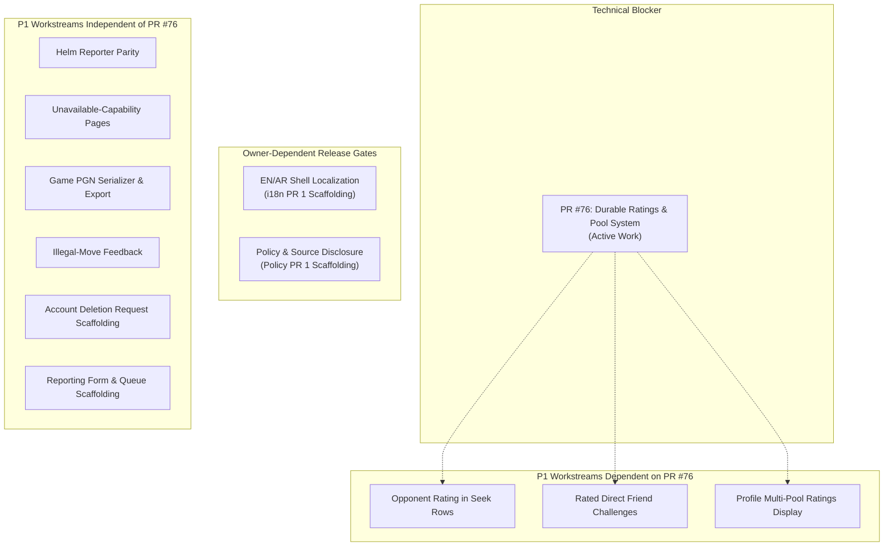
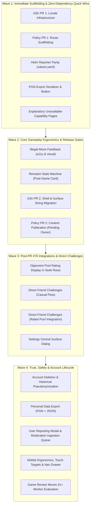

# Gemini Planning Artifact: Post-Gate P1 Implementation Sequencing

> [!IMPORTANT]
> **STATUS AND AUTHORITY NOTICE**
> - **Gemini-Generated Planning/Review Artifact**: This document was produced during Gemini read-only implementation-planning audits on 2026-09-30.
> - **Evidence Snapshot, Not Project Truth Forever**: Observations reflect repository commit `553751c628f69436600987ddbf649a13f2b9eb2d` (`origin/main`), with read-only awareness of active PR #76 (`295aa32261271b68d164e243bbf8a7457dff8360`).
> - **Pending Independent Codex Adjudication**: All technical recommendations and sequencing proposals are subject to independent review by Codex.
> - **NOT an Owner-Approved Priority Decision**: The sequencing and batching presented here represent planning recommendations, not approved owner roadmap commitments.
> - **NOT Authorization for Implementation**: This document does not authorize implementation without prior owner approval.
> - **Historical Findings Reverification**: Findings must be reverified against current `origin/main`.
> - **Current Repository Truth Wins**: Current repository and GitHub evidence strictly supersedes any statement in this document.

---

## 1. Context and Dependency Landscape

Following the authoritative Fable + Astra reconciliation, the platform's execution path is structured around three milestones:
1. **Technical Launch Blocker:** Durable ratings application with explicit `(variant, speed)` pools and truthful rating consumers (actively underway in **PR #76**).
2. **Owner-Dependent Release Gates:**
   * EN/AR shell localization and mixed-direction text readiness.
   * Privacy, Terms, Fair Play, and public AGPL source code disclosure.
3. **P1 Implementation Sequence:** Material functional gaps that must be resolved prior to public platform launch.

---

## 2. Reverified P1 Capability Inventory

Every P1 item from historical audits was reverified against fresh `origin/main` (`553751c628f69436600987ddbf649a13f2b9eb2d`):

| Capability / Finding | Verified Main Status | PR #76 Dependency? | Owner Decision Required? |
| :--- | :--- | :--- | :--- |
| **Helm Tournament Reporter** | Present in Docker Compose; omitted in Helm `values.yaml`. | **NO** (Pure config) | **NO** (Engineering deployment parity) |
| **Opponent Rating in Seeks** | Seek cards lack pool-accurate rating display. | **YES** (Needs PR #76 pool rating) | **NO** (Pure correctness follow-up) |
| **Game PGN Export** | No client PGN download serializer. | **NO** (Reads game event log) | **NO** (Engineering fact, standard PGN) |
| **Illegal-Move Feedback** | Invalid drag/click lacks a11y & visual feedback. | **NO** (Pure client UI) | **NO** (Interaction design, see note below) |
| **Unavailable Capability Pages** | Dead links or missing views for unready features. | **NO** (Client routing) | **NO** (Standard explanatory UI) |
| **Rematch Capability** | Post-game screen lacks rematch trigger. | **NO** (Game lifecycle) | **YES** (`D-09`: Color swap & settings rules) |
| **Direct Friend Challenges** | No direct invite link or targeted challenge. | **PARTIAL** (Casual = No; Rated = Yes) | **YES** (`D-08`: Casual vs rated; `D-10`: UX) |
| **Settings Surface** | Settings scattered; lacks centralized dialog. | **NO** (Client preferences) | **YES** (`D-16`: Launch scope vs deferred) |
| **Mobile Navigation & Touch** | Topbar overflows on mobile; touch targets < 44px. | **NO** (Responsive shell) | **YES** (`D-17`: Drawer vs bottom tab bar) |
| **Game Review 40-Move Limit** | Engine evaluation stops at ply 80 (move 40). | **NO** (Web worker engine) | **YES** (`D-15`: Tactical scan vs pagination) |
| **Account Deletion** | No mechanism for users to delete accounts. | **NO** (User account service) | **YES** (`D-11`: Pseudonymization vs purge) |
| **Personal Data Export** | No self-service data export. | **NO** (User account service) | **YES** (`D-12`: Export bundle scope & format) |
| **User Reporting & Moderation** | No in-game report form or review queue. | **NO** (Moderation service) | **YES** (`D-13`: Categories & review policy) |
| **Anti-Cheat Heuristic Action** | Analysis pipeline unlinked to penalty policy. | **NO** (Async analysis pipeline)| **YES** (`D-14`: Flagging vs automated bans) |

---

## 3. Critical Technical Clarifications & Invariants

To avoid regressions and duplicated effort during sequencing, the following engineering facts are pinned:

1. **Illegal-Move Feedback Must Not Introduce Hardcoded Strings:**
   * When implementing screen-reader announcements (`aria-live="#status"`) and visual feedback for illegal moves, engineering must NOT introduce new hardcoded English strings.
   * If i18n PR 1 has landed, use typed keys (e.g., `t('game.illegal_move')`). If i18n has not yet landed, provide non-verbal visual cues (board shake/square flash) and prepare the aria-live key hook.
2. **Direct Friend Challenges: Casual vs Rated Decoupling:**
   * A **strictly casual** direct challenge flow has **zero dependency on PR #76**. It can be engineered, tested, and shipped immediately using basic challenge tokens.
   * A **rated** direct challenge flow depends strictly on PR #76 merging first to establish valid `(variant, speed)` rating pools.
3. **Mobile Navigation Architecture is Confirmed Defect, but Pattern is Owner Choice:**
   * The defect (topbar overflow and touch target sizing < 44px on viewports < 768px) is physically verified.
   * However, the structural solution (Hamburger drawer vs persistent bottom tab bar) is an owner visual and ergonomic decision (`D-17`). Engineering must not unilaterally force a bottom tab bar onto the board view.
4. **Strict Boundary Against Promoting Deferred P2/P3 Scope:**
   * Items intentionally deferred in the Fable + Astra reconciliation (e.g., multi-engine selection, advanced study partner voice modes, custom board colorways, advanced community clubs) must remain deferred. They are not required for launch.

---

## 4. Recommended Concrete Engineering Sequencing

> [!NOTE]
> All sequences below are **planning recommendations** prepared by Gemini and are subject to Codex adjudication and owner authorization.

### Detailed Wave Breakdown

* **Wave 1 (Immediate Scaffolding & Quick Wins - Zero Blockers):**
  * `i18n-pr1`: LocaleManager, typed keys, storage abstraction, tests (no visible strings).
  * `policy-pr1`: Clean routes (`/privacy`, `/terms`, `/fair-play`, `/about`), view scaffolding, repo disclosure plumbing.
  * `deploy-helm-parity`: Enable `tournamentReporter.enabled: true` in `helm/values.yaml` to match Compose.
  * `pgn-export`: Add standard Seven Tag Roster PGN serializer and download action to finished game card.
  * `unavailable-routes`: Provide clean, informative placeholder views explaining upcoming capabilities for unlinked routes.

* **Wave 2 (Ergonomics & Release Gate Progression):**
  * `illegal-move-feedback`: Audio/visual shake and polite `#status` live announcement for illegal move attempts.
  * `rematch-flow`: Post-game rematch button proposing color-swapped game with identical time controls.
  * `i18n-pr2`: Full migration of hardcoded UI strings to `t(key)` and mounting of language toggle.
  * `policy-pr2`: Ingestion of approved policy text once owner/legal supply copy.

* **Wave 3 (Post-PR #76 Integrations):**
  * *Prerequisite:* PR #76 merged to `main`.
  * `seek-opponent-ratings`: Update lobby seek cards to show creator pool ratings accurately.
  * `friend-challenges`: Generate shareable challenge URLs and direct user-to-user challenges.
  * `settings-surface`: Mount launch settings dialog (Theme, Language, Sound, Move Cues).

* **Wave 4 (Trust, Safety & Mobile Polish):**
  * `account-deletion`: User-facing deletion request triggering PII scrubbing while preserving game moves as `[deleted]`.
  * `data-export`: Self-service download of account data and multi-game PGN bundle.
  * `reporting-moderation`: In-game player reporting modal feeding internal operator review table.
  * `mobile-ergonomics`: 44px+ touch target enforcement and mobile navigation drawer.
  * `game-review-depth`: Extended web worker evaluation for games exceeding 40 moves.
