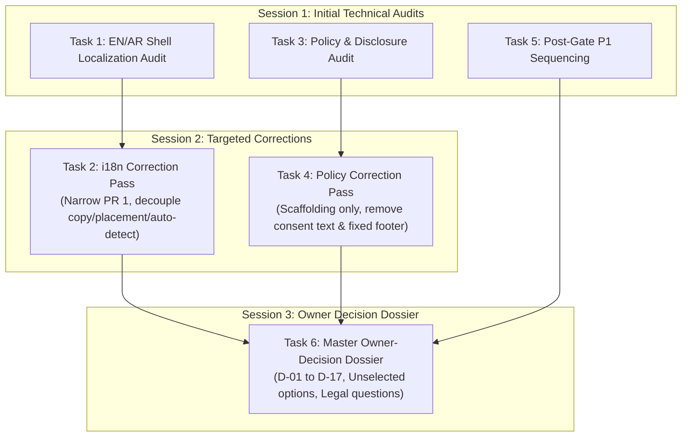

# Gemini Planning Index & Evidence Registry (2026-09-30)

> **Codex adjudication — 2026-10-02:** Independent Codex review of this entire historical document against current main `07946b9b03538ed73a3f7b773e7ad5a327d83805` is complete. Read the [current-main correction and disposition ledger](CODEX_GEMINI_PLANNING_ADJUDICATION_2026-10-02.md) before using any claim or sequence below. The original Gemini snapshot, recommendations and then-pending review status are preserved as historical evidence, not current implementation instructions or owner approval.

> [!IMPORTANT]
> **STATUS AND AUTHORITY NOTICE**
> - **Gemini-Generated Planning/Review Artifact**: This document and its associated planning dossiers were produced by Gemini during read-only planning audits on 2026-09-30.
> - **Evidence Snapshot, Not Project Truth Forever**: All observations, line numbers, SHAs, and architectural evaluations reflect the repository state at commit `553751c628f69436600987ddbf649a13f2b9eb2d` (head of `origin/main` as of 2026-09-30).
> - **Pending Independent Codex Adjudication**: All technical recommendations, proposed PR decompositions, and classified owner decisions are subject to mandatory independent review and adjudication by Codex before any implementation begins.
> - **NOT an Owner-Approved Product Decision**: Neither this index nor any referenced dossier constitutes an approved product decision, policy adoption, or design sign-off by the repository owner.
> - **NOT Authorization for Implementation**: No engineering work or pull requests implementing features should be merged based solely on these planning files.
> - **Historical Findings Reverification**: Historical Fable and Astra audit findings must continue to be reverified against current `origin/main` before implementation.
> - **Current Repository Truth Wins**: Current repository and GitHub evidence strictly supersedes any statement in this document.

---

## 1. Purpose of These Artifacts

On 2026-09-30, the repository owner authorized a structured series of read-only planning tasks to prepare concrete engineering sequencing for Rookzen (`sayed710/rocky`). These tasks focused on:
1. Resolving the remaining owner-dependent release gates (EN/AR shell localization and policy/legal/source disclosures).
2. Auditing post-gate P1 capabilities and dependencies following the technical blocker in PR #76.
3. Structuring genuine owner decisions into a clean, actionable dossier.

This index preserves the complete evidentiary provenance of that work, documents the evolution of recommendations across targeted correction passes, and provides pointers to the specialized audit documents.

---

## 2. Dossier Registry

| Document | Source Gemini Task | Original Target SHA | Description |
| :--- | :--- | :--- | :--- |
| [`GEMINI_I18N_PLANNING_2026-09-30.md`](GEMINI_I18N_PLANNING_2026-09-30.md) | Task 1 (Audit) & Task 2 (Correction) | `553751c628f69436600987ddbf649a13f2b9eb2d` | Comprehensive implementation plan for EN/AR shell localization, bidi isolation, and typography. |
| [`GEMINI_POLICY_DISCLOSURE_PLANNING_2026-09-30.md`](GEMINI_POLICY_DISCLOSURE_PLANNING_2026-09-30.md) | Task 3 (Audit) & Task 4 (Correction) | `553751c628f69436600987ddbf649a13f2b9eb2d` | Concrete engineering plan for Privacy Policy, Terms, Fair Play, and AGPL source code disclosure. |
| [`GEMINI_P1_SEQUENCING_2026-09-30.md`](GEMINI_P1_SEQUENCING_2026-09-30.md) | Task 5 (P1 Audit) | `553751c628f69436600987ddbf649a13f2b9eb2d` | Reverified inventory and concrete execution sequencing for all 14 P1 capabilities post-PR #76. |
| [`GEMINI_OWNER_DECISION_DOSSIER_2026-09-30.md`](GEMINI_OWNER_DECISION_DOSSIER_2026-09-30.md) | Task 6 (Owner Dossier) | `553751c628f69436600987ddbf649a13f2b9eb2d` | Structured inventory of 17 candidate owner decisions across language, policy, challenges, data privacy, and moderation. |

---

## 3. Provenance and History of Corrections

To ensure total transparency, where subsequent instructions or correction passes modified an initial recommendation, the earlier analysis is preserved alongside the corrected conclusion.

### Summary of Targeted Corrections

1. **EN/AR Shell Localization (Task 1 → Task 2):**
   - *Superseded Initial Recommendation*: PR 1 proposed bundling an initial Arabic production catalog and placing a language toggle in the topbar header.
   - *Corrected Position*: PR 1 must be strictly infrastructure-first (LocaleManager, typed keys, storage abstraction, tests). No visible Arabic strings and no permanent UI switcher placement may be locked in before explicit owner approval. Browser language auto-detection (`navigator.languages`) is an owner choice, not an engineering assumption; English remains the safe default. Typography requirements do not mandate bundling Noto Sans Arabic if system fallbacks suffice.

2. **Policy and Disclosure Gate (Task 3 → Task 4):**
   - *Superseded Initial Recommendation*: PR 1 included provisional consent language ("By continuing, you agree...") on registration and assumed a persistent global footer.
   - *Corrected Position*: Engineering must not invent or deploy legal consent wording without prior owner and legal counsel review. Placeholder pages with "Official publication pending" do *not* satisfy release gates. A global footer is not pre-approved; surface placement (footer vs contextual menu vs `/about` hub) is an owner visual/product decision. PR 1 is strictly routing/scaffolding infrastructure.

3. **Owner-Decision Dossier Presentation (Task 6 → Preservation PR):**
   - *Superseded Presentation*: Preliminary draft displayed pre-selected `[X]` checkboxes for recommended options.
   - *Corrected Position*: All checkboxes must remain strictly unselected (`[ ]`). No option may be presented as selected by the owner. Recommendations must be explicitly marked as *"Gemini recommendation — pending Codex review and owner decision."* Codex must independently adjudicate whether candidate items are genuine owner decisions or engineering implementation choices.

---

## 4. Relationship to Authoritative Repository Documents

These planning files **do not replace, overwrite, or deprecate** the following authoritative repository artifacts:
* `docs/audits/FABLE_ASTRA_FULL_AUDIT.md`: Authoritative Fable + Astra reconciliation audit.
* `docs/audits/ROOKZEN_VISUAL_HANDOFF.md`: Visual tokens, layout principles, and design system contracts.
* `docs/audits/RECOVERY_INDEX.md`: Historical recovery and branch ledger.
* `docs/audits/README.md`: Index and audit governance rules.
* `docs/PROJECT_STATE.md`: Append-only project state ledger.

All findings in these Gemini planning artifacts must be evaluated in conjunction with these authoritative baselines.

---

## 5. Historical Next Steps (superseded by Codex adjudication)

1. **Mandatory Codex Review**: Submit these planning artifacts for independent adjudication by Codex.
2. **Owner Decision Response**: The repository owner may use the response sheet in [`GEMINI_OWNER_DECISION_DOSSIER_2026-09-30.md`](GEMINI_OWNER_DECISION_DOSSIER_2026-09-30.md#7-owner-response-sheet) to record formal choices for Batches 1, 2, and 3.
3. **Execution Authorization**: Implementation PRs (beginning with i18n PR 1 and Policy PR 1) will be authored only after the owner and Codex approve the respective scope boundaries.

## 6. Codex adjudication completed

The mandatory independent Codex adjudication is recorded in the [2026-10-02 ledger](CODEX_GEMINI_PLANNING_ADJUDICATION_2026-10-02.md). It covers all five artifacts, all 14 P1 entries, all 17 candidate owner decisions and the seven original Greptile findings. PR #76 is merged as Increment 78; #81 and #83 are merged as Increments 80 and 81. The historical snapshot SHA above is unchanged. No owner options were selected and no feature implementation is authorized by this documentation PR.
