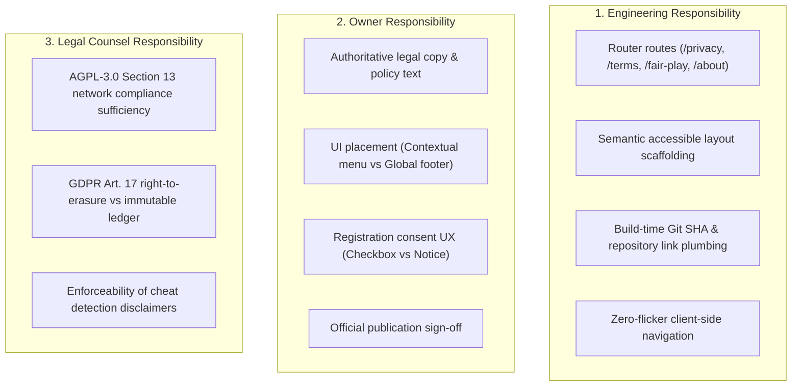

# Gemini Planning Artifact: Policy Surfaces & AGPL Source Disclosure

> [!IMPORTANT]
> **STATUS AND AUTHORITY NOTICE**
> - **Gemini-Generated Planning/Review Artifact**: This document was produced during Gemini read-only implementation-planning audits on 2026-09-30.
> - **Evidence Snapshot, Not Project Truth Forever**: Observations and repository inspections reflect commit `553751c628f69436600987ddbf649a13f2b9eb2d` (`origin/main`).
> - **Pending Independent Codex Adjudication**: All technical recommendations and scaffolding plans are subject to independent review by Codex.
> - **NOT an Owner-Approved Product Decision**: No policy text, consent UX, or navigation placement here has been approved by the repository owner.
> - **NOT Legal Advice**: This engineering analysis does NOT provide legal advice and does NOT assert statutory compliance with GDPR, AGPL-3.0, or consumer protection laws.
> - **NOT Authorization for Implementation**: This document does not authorize implementation without prior owner approval.
> - **Historical Findings Reverification**: Findings must be reverified against current `origin/main`.
> - **Current Repository Truth Wins**: Current repository and GitHub evidence strictly supersedes any statement in this document.

---

## 1. Original Policy & Disclosure Implementation Plan (Task 3)

### 1.1 Verified Missing Policy Surfaces
A comprehensive inspection of the client routing table (`packages/web/src/router.ts`) and UI views confirmed that Rookzen lacks dedicated, discoverable public pages for:
1. **Privacy Policy (`/privacy`):** Explaining data collection, user authentication, cookie usage, analytics, and game retention.
2. **Terms of Service (`/terms`):** Governing platform access, acceptable conduct, intellectual property, and account rules.
3. **Fair Play Policy (`/fair-play`):** Defining prohibited unauthorized assistance (chess engines, opening books, multi-accounting), detection protocols, and penalties.
4. **AGPL-3.0 Source Code Disclosure:** Providing network users with prominent access to corresponding source code as required by the AGPL-3.0 copyleft license.

### 1.2 Current Data and Practice Inventory
Engineering verified the following live data practices in the existing codebase that any future Privacy Policy must accurately reflect:
* **Account Credentials & Auth:** Stores email addresses, password hashes (Argon2id/bcrypt), WebAuthn credentials, and JWT session tokens.
* **Cookies & Local Storage:**
  * HttpOnly session refresh cookies.
  * `localStorage` for UI preferences (`cb_theme`, upcoming `cb_locale`).
  * `sessionStorage` for ephemeral game state.
* **Game History & Event Store:**
  * All chess moves, timestamps, clock states, and participant user IDs are permanently recorded in an immutable, append-only event ledger.
  * Games are publicly queryable by game ID.
* **Telemetry & Infrastructure Logs:**
  * Ingress access logs (client IP address, User-Agent, endpoint timestamp).
  * WebSocket connection metrics.
  * Sentry/Pino error telemetry.

### 1.3 Current Repository, License, and Source Disclosure Inventory
* Root of repository contains `LICENSE` (GNU Affero General Public License v3.0).
* Git commit metadata and GitHub repository URL (`sayed710/rocky`) are embedded during production Docker builds.
* Currently, **no public link or UI affordance exists in the web shell** pointing network players to the source repository.

### 1.4 Clear Separation of Responsibilities

### 1.5 Initial PR Decomposition (Task 3 Baseline)
* **PR 1:** Routing, Scaffolding, Static Policy Pages with provisional text, and persistent Global Footer.
* **PR 2:** Registration Form Consent Checkbox & Auth Form Integration.
* **PR 3:** Final Legal Text Ingestion.

---

## 2. Targeted Correction & Superseding Decisions (Task 4)

During the targeted correction pass (Task 4), several assumptions in the Task 3 baseline were identified as overstepping engineering authority and conflating scaffolding with gate satisfaction. The plan was corrected as follows:

### 2.1 Summary of Corrections

| Area | Initial Task 3 Recommendation (SUPERSEDED) | Corrected Position (Task 4 / Authoritative Baseline) |
| :--- | :--- | :--- |
| **Registration Consent Copy** | Added provisional text: *"By continuing, you agree to our Terms and Privacy Policy."* | **SUPERSEDED.** Engineering must NEVER invent or deploy consent wording without owner and legal review. Remove all invented consent language from PR 1. |
| **Placeholder Policy Pages** | Proposed deploying placeholder pages with *"Official publication pending owner review"*. | **SUPERSEDED.** Placeholder pages do NOT satisfy the owner release gate. They provide route scaffolding only; release gate remains open until authoritative policy is ingested. |
| **Global Footer Placement** | Hardcoded a persistent footer across all routes in PR 1. | **SUPERSEDED.** Global footer placement is an owner visual/product decision (`D-06`). A persistent footer must not be forced into the application shell. |
| **PR 1 Scope** | Combined routes, content placeholders, footer, and consent text. | **SUPERSEDED.** PR 1 is strictly infrastructure/scaffolding only: router endpoints, semantic view containers, and repo link plumbing. |
| **Legal Sufficiency Claims** | Implied that GitHub repository links fully satisfy AGPL requirements. | **SUPERSEDED.** Legal sufficiency is strictly a question for legal counsel, not an engineering determination. |

### 2.2 Revised Infrastructure-Only PR 1 Scope

```mermaid
flowchart LR
    subgraph PR1["Policy PR 1: Scaffolding Only"]
        direction TB
        R1["Router registration (/privacy, /terms, /fair-play, /about)"]
        R2["Semantic Article Scaffold (&lt;article&gt;, &lt;h1&gt;, aria-labelledby)"]
        R3["Source Disclosure Plumbing (VITE_GIT_SHA, Repo URL helper)"]
        R4["Automated Route & Component Unit Tests"]
        R5["NO legal copy / NO invented consent / NO forced footer"]
    end

    subgraph Gate["Owner & Legal Review Gate"]
        G1["Owner supplies approved text"]
        G2["Owner decides placement (D-06, D-07)"]
        G3["Legal counsel verifies sufficiency"]
    end

    subgraph PR2["Policy PR 2: Content & Polish"]
        P1["Ingest official policy text"]
        P2["Mount links at owner-approved UI slot"]
        P3["Implement approved consent UX"]
    end

    PR1 --> Gate --> PR2
```

1. **Policy PR 1: Route & Surface Scaffolding Only (Immediate Engineering Focus):**
   * Registers clean routes in `packages/web/src/router.ts`:
     * `/privacy`
     * `/terms`
     * `/fair-play`
     * `/about` (or `/legal`)
   * Creates semantic view containers (`packages/web/src/ui/legal/`) implementing proper accessibility landmarks (`<article>`, `<header>`, `<h1>`, `aria-labelledby`).
   * Provides repository and license disclosure plumbing (reading `VITE_GIT_SHA` and `VITE_REPO_URL` from build environment).
   * Adds automated unit and integration tests asserting route resolution, title rendering, and scroll-to-top behavior.
   * **Contains NO unapproved legal copy, NO invented consent disclaimers, and NO forced persistent footer.**

2. **Policy PR 2: Content Publication & UI Integration (Awaiting Owner & Legal Actions):**
   * Ingests owner-approved, legally vetted policy text for Privacy, Terms, and Fair Play.
   * Mounts discoverable links in the owner-approved UI slot (resolved via `D-06`).
   * Implements the owner-approved registration consent mechanism (resolved via `D-07`).
   * Fully satisfies the owner-dependent release gate.
